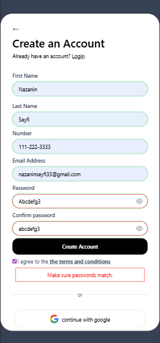

📝 Modern Signup Form

A modern and responsive signup form built with Vanilla JavaScript and Tailwind CSS, featuring real-time validation and enhanced user experience.

✨ Features:

✅ Responsive layout (mobile-first)
✅ HTML5 form validation
✅ Password visibility toggle
✅ Confirm password matching
✅ Terms & conditions validation
✅ Accessible form elements (ARIA labels)
✅ Clean and modern UI with Tailwind CSS

🔹 Built with a focus on usability, accessibility, and clean code practices.

🚀 Live Demo:
👉 https://nazanin-dev.github.io/modern-signup-form/

Desktop view:  

Mobile view:  

👩‍💻 Developed by Nazanin Seyfi

📅 Created on: Feb, 2026

🛠 Technologies Used:

- HTML5
- Tailwind CSS
- Vanilla JavaScript

🌟 My Role:
Frontend Developer

📬 How to reach me:

- LinkedIn: https://www.linkedin.com/in/nazanin-seyfi-4a1742331/
- GitHub: https://github.com/nazanin-dev
